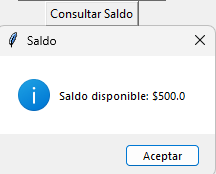

# Simulación de Cuenta Bancaria

Este es un proyecto de simulación de una cuenta bancaria, donde puedes realizar operaciones comunes como consultar saldo, depositar dinero, retirar dinero, transferir fondos entre cuentas y mantener un historial de transacciones. La aplicación está desarrollada en Python utilizando la biblioteca **Tkinter** para la interfaz gráfica.

## Aplicacion .EXE
[Aplicacion](https://drive.google.com/file/d/1YMJpfDrr0VpSDJoqWrSzAvjpsv8ZKH58/view?usp=sharing)

## Características

- Crear una cuenta bancaria con un número de cuenta único, nombre del titular, saldo inicial y tipo de cuenta.
- Consultar el saldo de la cuenta seleccionada.
- Depositar dinero en una cuenta.
- Retirar dinero de una cuenta.
- Transferir dinero entre cuentas bancarias.
- Mostrar el historial de transacciones realizadas.
- Seleccionar una cuenta activa para realizar operaciones.

## Capturas de Pantalla
<table>
  <tr>
    <td></td>
    <td></td>
    <td></td>
    <td></td>
    <td></td>
    <td></td>
    <td></td>
    <td></td>    
  </tr>
</table>

## Requisitos

Para ejecutar este proyecto, necesitas tener instalado **Python 3** y las siguientes bibliotecas:

- Tkinter (generalmente preinstalada en la mayoría de las instalaciones de Python)

Si no tienes Python instalado, puedes descargarlo desde [aquí](https://www.python.org/downloads/).

### Instalación de dependencias (si es necesario)

Aunque Tkinter generalmente viene preinstalado, si tienes problemas con la instalación de Tkinter, puedes instalarlo ejecutando:

```bash
pip install tk
